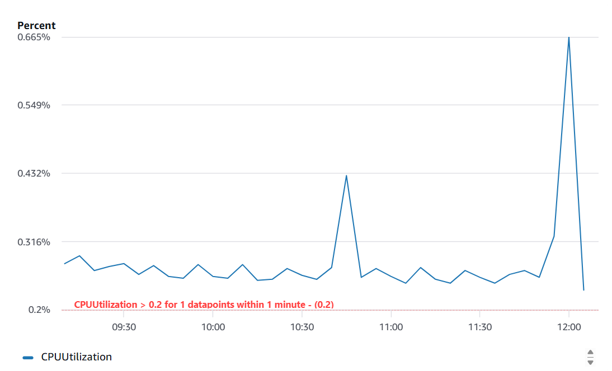
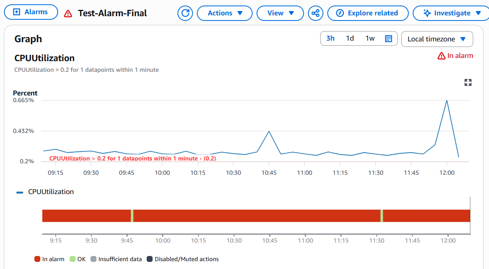

# aws-ec2-monitoring-alert-system
Real-time EC2 monitoring and alert system using AWS CloudWatch and SNS.
# 🚀 AWS EC2 Monitoring, Logging & Alert System

## 📌 Project Overview
This project demonstrates a real-time monitoring and alerting system built on AWS.  
An EC2 instance is continuously monitored using CloudWatch, and alerts are triggered via SNS when system thresholds are exceeded.

---

## 🛠 AWS Services Used
- **EC2** – Hosting the web server  
- **CloudWatch** – Monitoring metrics and logs  
- **SNS** – Sending real-time notifications  
- **IAM** – Secure access management  

---

## ⚙️ Key Features
- Hosting a web application on EC2  
- Monitoring CPU utilization using CloudWatch  
- Setting threshold-based alarms  
- Real-time email alerts using SNS  
- Centralized system monitoring  

---

## 🚀 Implementation Steps (High Level)
1. Launched an EC2 instance and configured a web server  
2. Installed and configured CloudWatch Agent  
3. Collected system metrics (CPU usage)  
4. Created CloudWatch alarms for threshold detection  
5. Configured SNS topic for notifications  
6. Tested system by generating CPU load  

---

## 📊 Workflow Diagram
User
↓
EC2 Instance (Web Server)
↓
CloudWatch Metrics
↓
CloudWatch Alarm
↓
SNS Topic
↓
Email Notification

---

## 🧪 Testing
- Simulated CPU load using shell commands  
- Observed system transition from **OK → ALARM**  
- Verified email notifications  

---

## 🎯 Use Case
- Server performance monitoring  
- Learning AWS cloud fundamentals  
- Real-time alerting system  

---

## 🧠 Key Learnings
- Understanding of cloud monitoring systems  
- Practical use of CloudWatch and SNS  
- Implementation of alert-based automation  
- Hands-on experience with AWS services  

---

## 👩‍💻 Author
Shreya Gupta

## 📸 Screenshots

### 🔹 Monitoring Graph

### 🔹 Alarm Triggered

